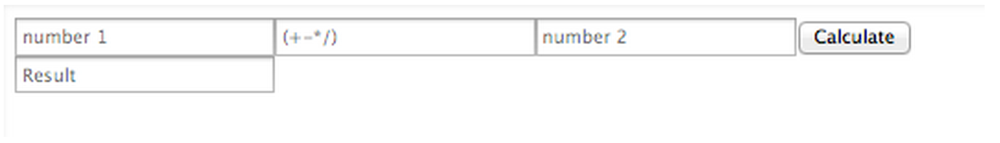

# Calculator 

### Basic Calculator

1. Add base input functionality to your calculator via 2 input fields, one for each number
2. Add operator functionality to your calculator via 1 input field, for the operator (+, -, *, /)
3. Add a calculate button that takes your two numbers and does work on them based on your operator
4. Return the result to an input field
5. **Extra credit:** Return any error message to an element below the result

### Basic Layout

